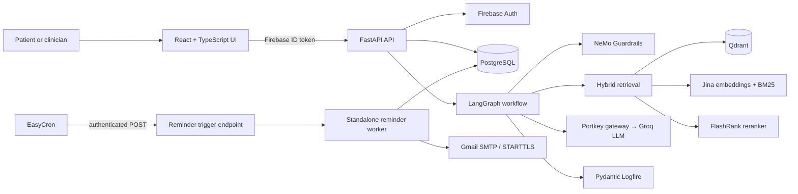

# MedAssist AI

> A full-stack, safety-oriented medical information assistant that combines grounded retrieval, agentic orchestration, authenticated patient context, and reliable medication reminders.

[](https://www.python.org/)
[](https://fastapi.tiangolo.com/)
[](https://react.dev/)
[](https://www.typescriptlang.org/)
[](https://www.postgresql.org/)
[](https://qdrant.tech/)

## Why MedAssist

MedAssist is built for medical information workflows where a fluent answer is not enough. It retrieves from a curated knowledge base, reranks evidence before generation, applies input/output safety controls, and clearly separates informational guidance from clinical diagnosis.

It also includes authenticated chat history and timezone-aware medication reminders with PostgreSQL-backed delivery state, external scheduling, retry handling, and Gmail SMTP delivery.

> MedAssist provides general medical information only. It is not a diagnostic, emergency, or prescribing system.

## Architecture



## Technical highlights

- Grounded medical answers from a curated corpus rather than unbounded model recall.
- Dense Jina retrieval plus BM25 sparse retrieval in Qdrant, followed by FlashRank reranking.
- LangGraph state machine for guard, retrieve, rerank, generate, and tool-routing stages.
- Firebase-verified API access; PostgreSQL owns profiles, conversations, reminders, and delivery audit history.
- Timezone-aware reminders with idempotent occurrences, row locking, retry backoff, and Gmail SMTP delivery.
- Evaluation utilities for Recall@k, MRR, nDCG, and Top-1 retrieval accuracy.

## Technology stack

| Layer | Technologies |
| --- | --- |
| Web client |     |
| API and validation |    |
| Agentic RAG |    |
| Retrieval |     |
| Model and observability |    |
| Identity and data |     |
| Reminder delivery |    |
| Local infrastructure |  |

## Repository layout

```text
backend/
├── agent/             # LangGraph workflow, Groq/Portkey client, guardrails, reranking
├── core/              # Configuration, Firebase authentication, Logfire setup
├── db/                # PostgreSQL schema, repository, Alembic migrations
├── retrieval/         # Qdrant hybrid retrieval and corpus ingestion
├── services/          # Gmail transport and independent reminder worker
├── tests/             # Unit tests and retrieval evaluation utilities
└── api.py             # FastAPI application

frontend/
└── src/               # React chat, auth, reminder, and API client UI
```

## Run locally

### 1. Prerequisites

- Python 3.11 or later
- Node.js 20 or later
- Docker Desktop
- A Firebase project and web application configuration
- Jina, Portkey, Groq, and Gmail SMTP credentials

### 2. Configure environment variables

Copy the examples and fill only the credentials you own:

```bash
cp .env.example .env
cp backend/.env.example backend/.env
cp frontend/.env.example frontend/.env
```

Important backend values include Firebase Admin credentials, `JINA_API_KEY`, `PORTKEY_API_KEY`, `GROQ_API_KEY`, and the `SMTP_*` Gmail App Password settings. Never commit these values.

### 3. Start local data services and install dependencies

```bash
docker compose up -d

cd backend
python -m venv .venv
source .venv/bin/activate
python -m pip install -r requirements.txt
alembic upgrade head

cd ../frontend
npm install
```

### 4. Index the medical corpus

```bash
cd backend
source .venv/bin/activate
python -m retrieval.ingest --batch-size 50
```

Use `--start <offset>` to resume a previously interrupted ingestion run.

### 5. Start the application

In one terminal:

```bash
cd backend
source .venv/bin/activate
uvicorn api:app --reload
```

In another terminal:

```bash
cd frontend
npm run dev
```

## Email reminder scheduling

The reminder worker is independent of FastAPI scheduling and can still run as a CLI:

```bash
cd backend
source .venv/bin/activate
python -m services.reminder_worker
```

For EasyCron with Cloudflare Tunnel, configure a one-minute `POST` request to:

```text
https://<your-tunnel-host>/internal/reminders/run
```

Add this request header in EasyCron:

```text
X-Reminder-Worker-Token: <REMINDER_WORKER_TRIGGER_TOKEN>
```

Set the same long random value in `backend/.env`. The endpoint returns a delivery summary and is protected from unauthenticated invocation. Do not put this token in the URL.

## Quality checks

Run the backend tests:

```bash
cd backend
source .venv/bin/activate
pytest -q tests
```

Build the frontend:

```bash
cd frontend
npm run build
```

Run retrieval evaluation after indexing:

```bash
cd backend
source .venv/bin/activate
python tests/evaluation.py
```

## Security and safety notes

- Firebase ID tokens are verified server-side before user data is accessed.
- PostgreSQL is the source of truth for reminder schedules and delivery state.
- Every email occurrence is unique by `(reminder_id, scheduled_for)` and claimed with database row locking.
- SMTP credentials and scheduler trigger tokens are environment-only secrets.
- The retrieval pipeline uses guardrails and source-grounding, but output still requires clinical judgement.

## License

No license has been specified for this repository.
